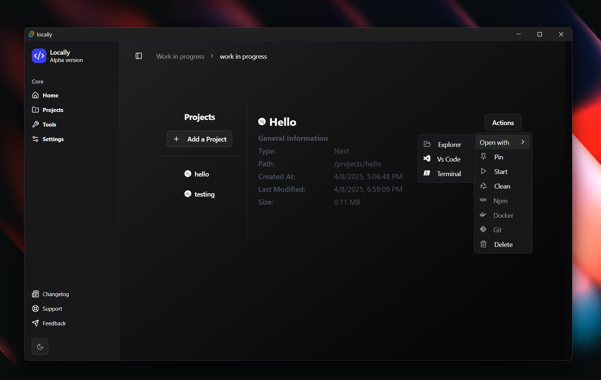
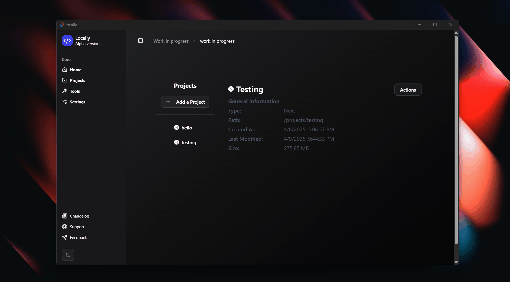
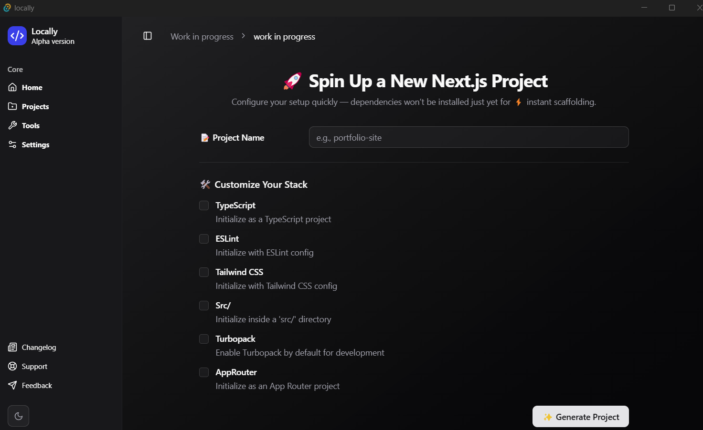

  
# Locally

### A Powerful Local Development Manager

  <strong>Streamline your development workflow with a single, elegant interface.</strong>

    

## Overview

Locally is a lightweight, high-performance tool designed to revolutionize local development workflows. Built with Rust and Tauri, it offers a seamless experience for managing projects, dependencies, and packages across multiple frameworks—all from one intuitive interface.

## ✨ Key Features

- **📂 Unified Project Management** — Organize and access all your local projects from a centralized dashboard.
- **🔄 Smart Dependency Tracking** — Automatically detect and update outdated dependencies with a single click.
- **📦 Intuitive Package Management** — Install, remove, and manage dependencies through a clean graphical interface.
- **🛠️ Multi-Framework Support** — First-class support for React, Angular, Next.js, and Vue projects.
- **⚡ Blazing Fast Performance** — Built with Rust and Tauri for minimal resource usage and maximum speed.
- **🎨 Beautiful User Experience** — Polished interface built with ShadCN UI components.

## 🖥️ Supported Frameworks

| Framework | Status | Version Support |
|-----------|--------|-----------------|
| React     | ✅     | 16.8+ |
| Angular   | ✅     | 9+ |
| Next.js   | ✅     | 10+ |
| Vue.js    | ✅     | 2.6+, 3.x |

## 🔧 Technology Stack

<table>
  <tr>
    <td align="center"><strong>Core Engine</strong></td>
    <td align="center"><strong>UI Framework</strong></td>
    <td align="center"><strong>Desktop Framework</strong></td>
  </tr>
  <tr>
    <td align="center">Rust</td>
    <td align="center">ShadCN UI</td>
    <td align="center">Tauri</td>
  </tr>
</table>

## 💫 Interface

  

      
      

  

## 🚀 Getting Started

### System Requirements

- Windows 10/11, macOS 10.15+, or Linux (Ubuntu 20.04+)
- 100MB of disk space

### Installation

Download the latest version for your platform:

- [Windows](https://github.com/Jihedbz/locally/releases) (.exe, .msi)
- [macOS](https://github.com/Jihedbz/locally/releases) (.dmg)
- [Linux](https://github.com/Jihedbz/locally/releases) (.AppImage, .deb)

⚠️ **Currently Under Development** — More features and improvements coming soon!

## 🤝 Contributing

We welcome contributions of all kinds! Here's how you can help:

- **Star the repo** to show your support
- **Open issues** for bugs or feature requests
- **Share feedback** on the user experience

## 📜 License

Locally is available under the MIT License. See the [LICENSE](LICENSE) file for more information.

## 📮 Contact

Have questions? Reach out to us:

- [GitHub Issues](https://github.com/Jihedbz/locally/issues)
- [Email Support](mailto:jih3db@gmail.com)

---

  Built with ❤️ by Jihedbz and contributors

