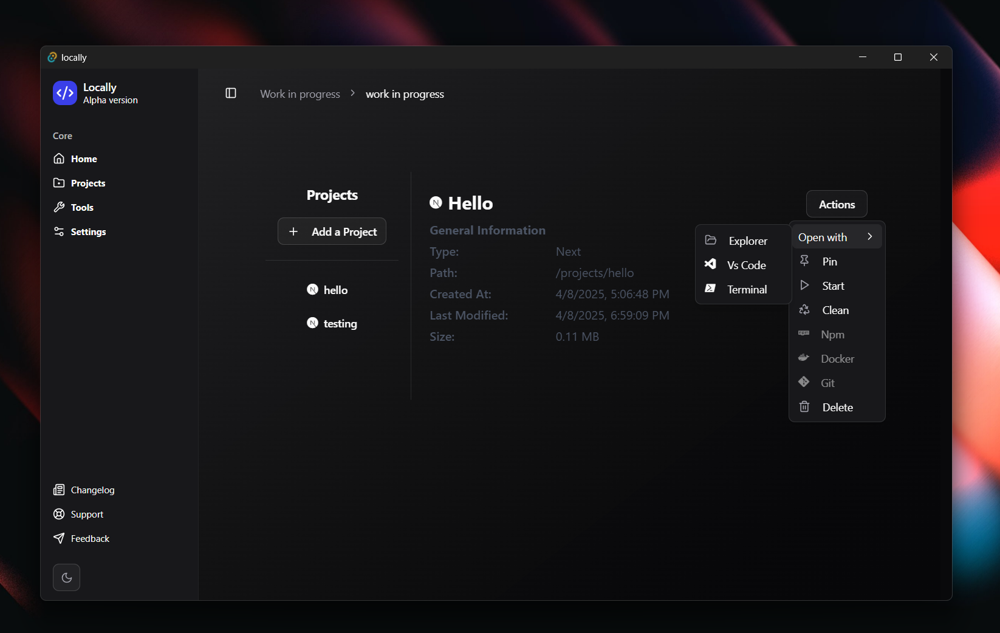
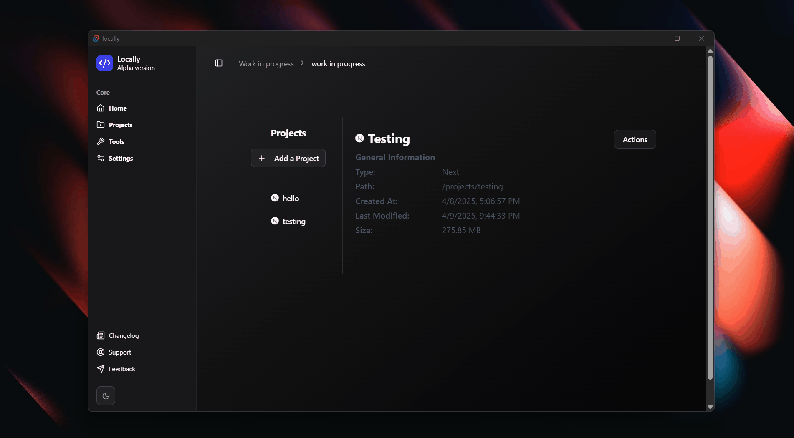
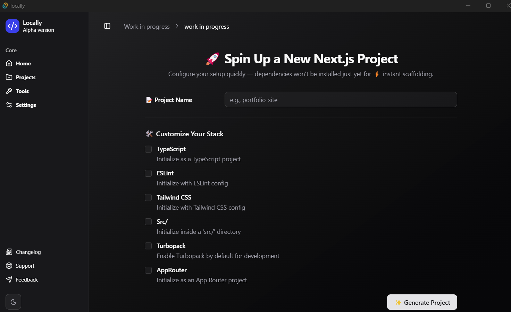

  
    
  <h3>Stop context-switching. Start shipping.</h3>
  
A native desktop app for managing your entire local dev environment — projects, dependencies, packages — from one place.

  

    
    
    
    
    
  

   
  

 

---

You already know the problem. Five terminals open. `npm outdated` in one, `docker ps` in another, a file explorer somewhere, an IDE somewhere else. Every project lives in its own corner of your machine with no single view of what's running, what's broken, or what needs updating.

**Locally** is a lightweight native app that gives you that view. Built with Rust and Tauri — fast, small, and it doesn't get in your way.

 

## What it does

<table>
<tr>
<td width="50%">

**📁 Project Dashboard**  
Every local project in one place. Open, switch, and organize without touching Finder or Explorer.

**📦 Package Management**  
Install, remove, and audit dependencies through a clean UI — no terminal needed for the routine stuff.

</td>
<td width="50%">

**🔍 Dependency Tracking**  
Spot outdated packages across all your projects at once, not just the one you happen to have open.

**⚡ Actually Lightweight**  
Rust + Tauri. Starts in under a second. Won't eat your RAM while you're doing real work.

</td>
</tr>
</table>

 

## In action

  
    
  

 

## Framework support

React `16.8+` · Angular `9+` · Next.js `10+` · Vue `2.6+, 3.x`

 

## Built with

Rust · Tauri · Angular · ShadCN UI · Tailwind CSS

 

## Roadmap

Locally is actively developed. The end goal is a complete local dev workspace — the single app you reach for instead of five others.

Coming up: Docker integration · Git tools · Terminal management · Monorepo support · Environment management · Workspace sessions · Plugin ecosystem

 

## Contributing

Bug reports, feature ideas, docs fixes, PRs — all welcome. If this saves you time, a ⭐ helps more than you'd think.

 

## Privacy

Everything runs locally. Your projects and data never leave your machine.

 

## License

MIT — see [LICENSE](LICENSE).

 

---

  Built by <a href="https://github.com/Jihedbz">Jihedbz</a> · <a href="https://github.com/Jihedbz/Locally/issues">Open an issue</a> · jih3db@gmail.com

